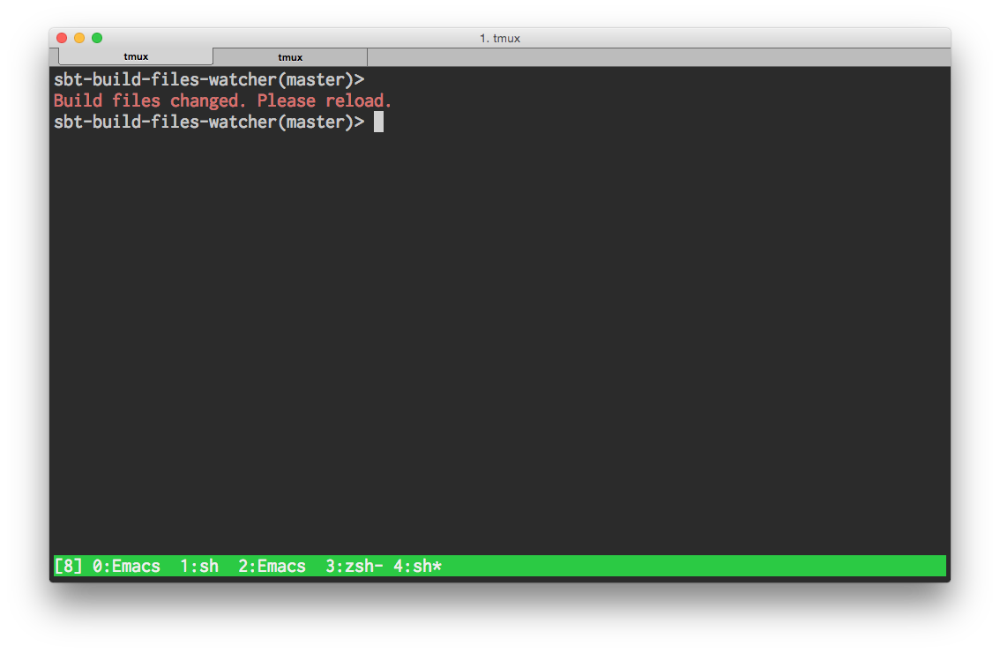

# sbt-build-files-watcher



## Install

```scala
// ~/.sbt/0.13/plugins/build.sbt or ~/.sbt/1.0/plugins.build.sbt
addSbtPlugin("com.github.tototoshi" % "sbt-build-files-watcher" % "0.2.0")
```

## Usage

```scala
// ~/.sbt/0.13/build.sbt or ~/.sbt/1.0/build.sbt
showMessageOnBuildFilesChanged
```

with sbt-git
```scala
shellPrompt := { state =>
  messageOnBuildFilesChanged(state) + GitCommand.prompt(state)
}
```
